Terraform
-----------------------
* First we can create a VM(Instance),in that install awscli
``` 
  sudo apt-get update
  sudo apt install awscli
  aws configure
```
 [Refer here](https://developer.hashicorp.com/terraform/downloads)

* Next install terraform in that VM

```
sudo apt-get update
wget -O- https://apt.releases.hashicorp.com/gpg | sudo gpg --dearmor -o /usr/share/keyrings/hashicorp-archive-keyring.gpg
echo "deb [signed-by=/usr/share/keyrings/hashicorp-archive-keyring.gpg] https://apt.releases.hashicorp.com $(lsb_release -cs) main" | sudo tee /etc/apt/sources.list.d/hashicorp.list
sudo apt update && sudo apt install terraform

```

* we can create a folder with any name in that create files with this names 
    input.tf
    output.tf
    main.tf
    provider.tf

* main.tf in this file we can add ami id 
* amiID is any region it's same we can take always this amiid click on launch template 
* 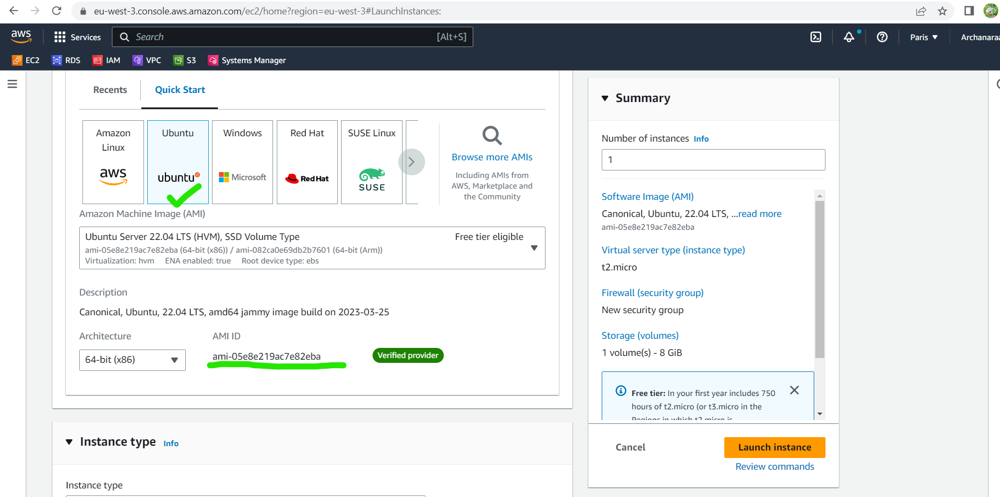 
* 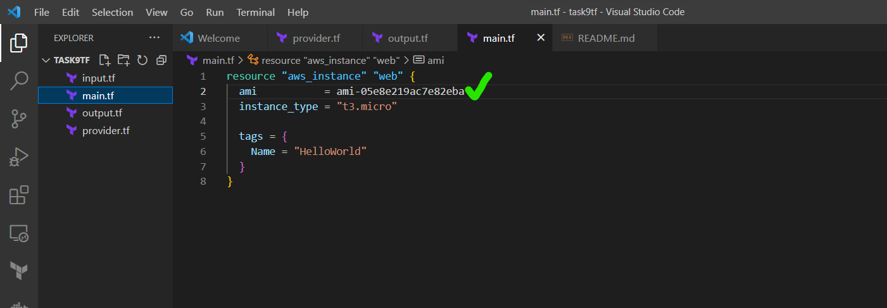
  [Referhere](https://registry.terraform.io/providers/hashicorp/aws/latest/docs/resources/instance#attributes-reference) 
  for creating instances,vpc,subnets copy paste and change names in main.tf
* next goto that folder 
```
terraform init
terraform validate
terraform apply

```
next see in my aws acnt
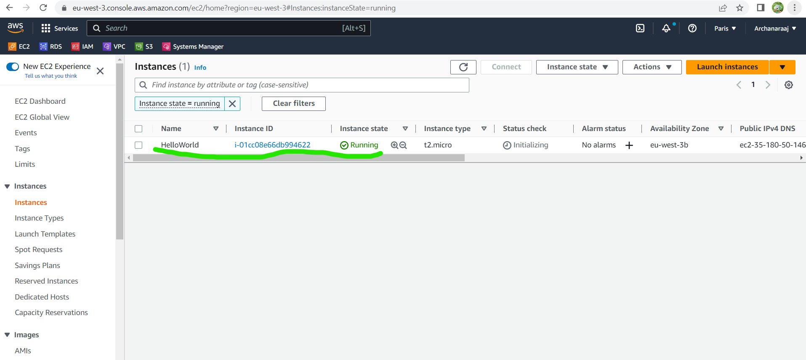
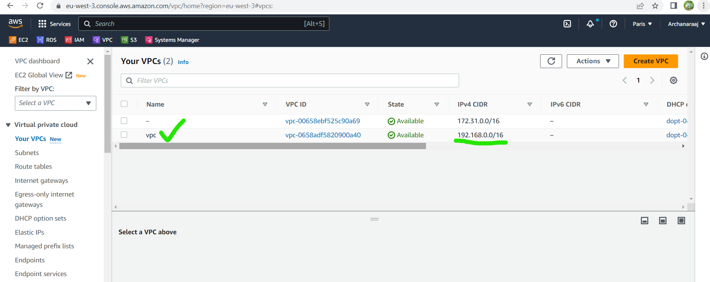
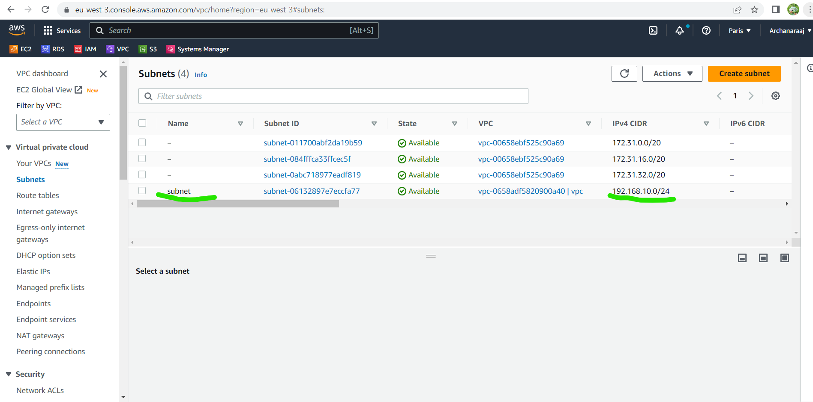
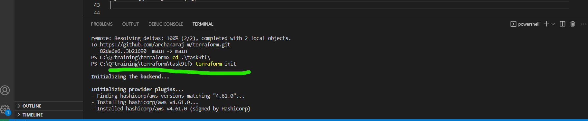

```
terraform destroy

```
check it again in aws vpc,subnet,instance all are deleted at a time with destory command.

### created vpc,subnets
----------------------

* In terraform documentation created subnets and vpc's use that documentation code we can create the vpc's, subnets.
* after goto that folder ``<terraform console>``
* 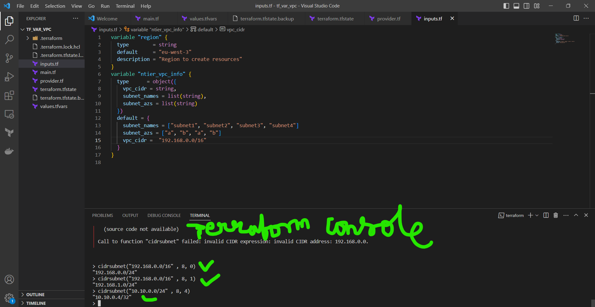
* for creating subnets terraform console output

``` 

 > cidrsubnets("10.10.0.0/16" , 8, 4, 8, 4)
tolist([
  "10.10.0.0/24",
  "10.10.16.0/20",
  "10.10.32.0/24",
  "10.10.48.0/20",
])
> exit

```
* Next change the variables in inputs file and values.tfvars execute
  ``terraform console``
  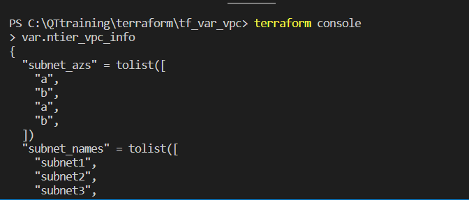
  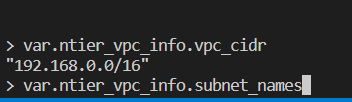
* Next use this command
  
```
terraform apply -var-file ./values.tfvars

terraform destroy

```
* for creating another 2 subnets change in values.tfvars file

```
ntier_vpc_info = {
  subnet_names = ["subnet1", "subnet2", "subnet3", "subnet4", "subnet5", "subnet6"]
  subnet_azs   = ["a", "b", "a", "b" , "a", "b"]
  vpc_cidr     = "192.168.0.0/16"
}

```
terraform apply -var-file ./values.tfvars

yes

* After that creating remaing two subnets

``terraform destroy``

### terraform graph

[Referhere](https://dreampuf.github.io/GraphvizOnline/)

```
terraform graph

```
After that command used some code came in that {..} copy that and paste in graphviz website then graph came.
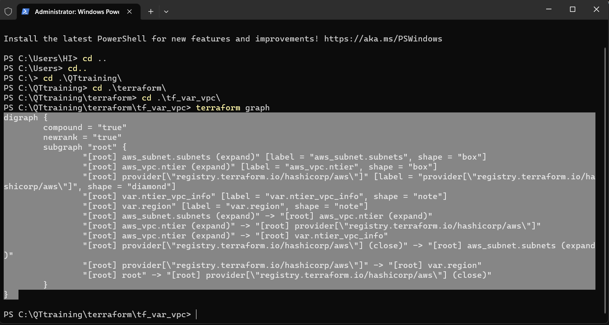
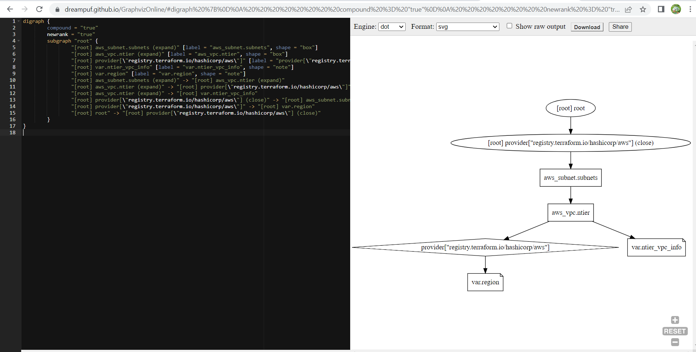

* see the vm image list command is
```
aws vm image list --location 'euwest'

```

### Ntier in AWS

* making subnets private and public
  first we can create internet gateway with ref google terraform internetgateway
  [Referhere](https://registry.terraform.io/providers/hashicorp/aws/4.36.0/docs/resources/internet_gateway.html)
  
```
  resource "aws_internet_gateway" "ntier_igw" {
  vpc_id = aws_vpc.ntier.id
  tags = {
    Name = "ntier_igw"
  }
}

```
* Above resource paste in main.tf(network.tf)
* After that terraform init and terraform fmt and terraform apply

```
terraform apply -var-file .\dev.tfvars

```
* 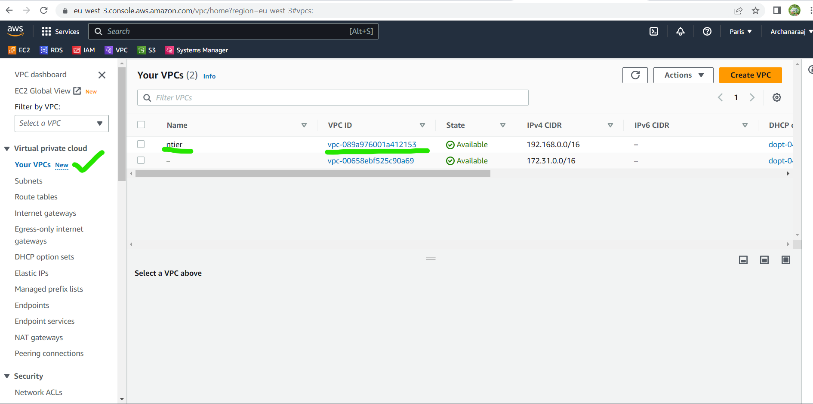
* 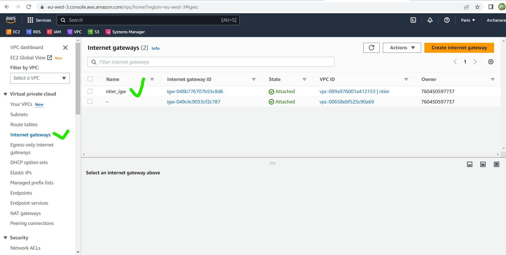
* 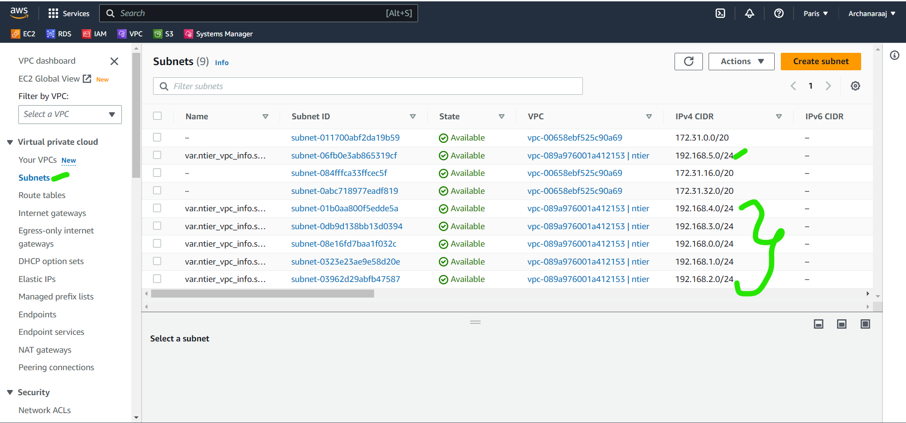


```
terraform destroy

```

### Creating route table(private,public)

[Referhere](https://registry.terraform.io/providers/-/aws/latest/docs/resources/route_table)
for route table association
[Referhere](https://registry.terraform.io/providers/-/aws/latest/docs/resources/route_table_association)


