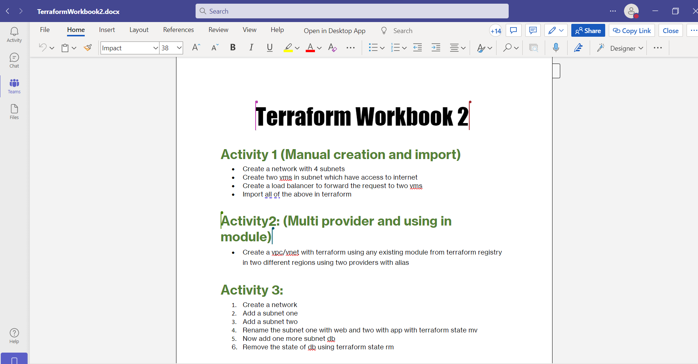
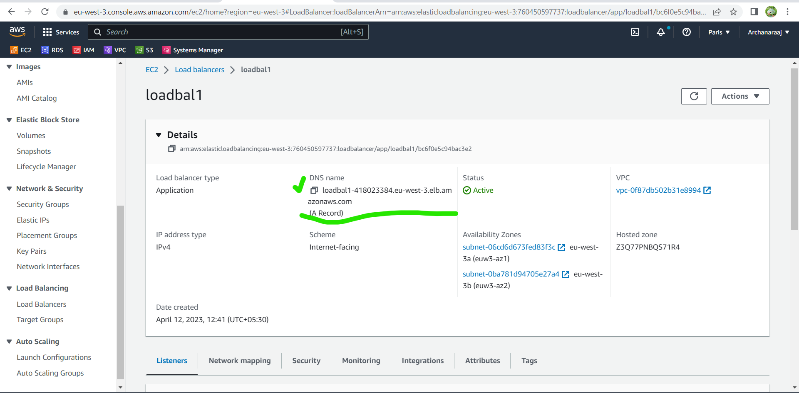
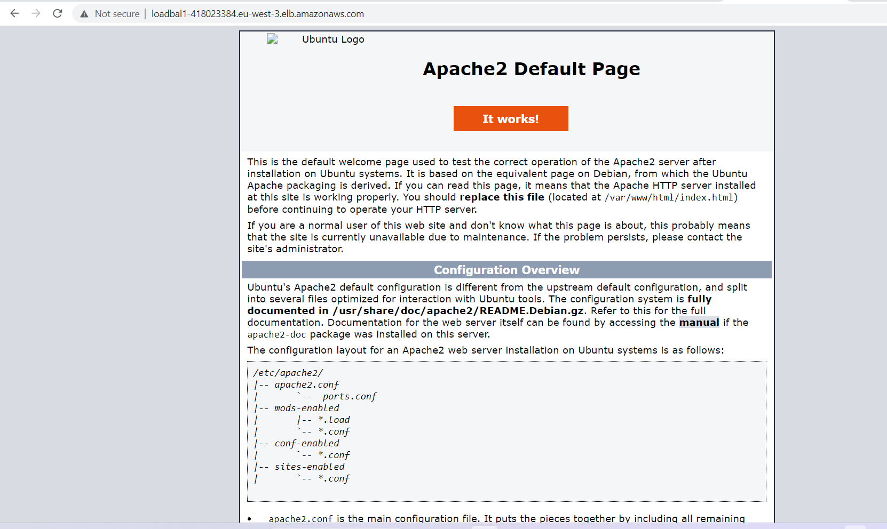
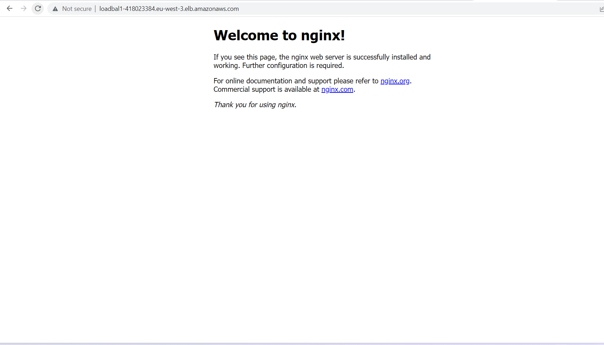
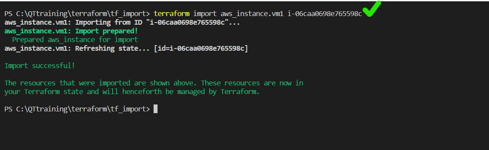
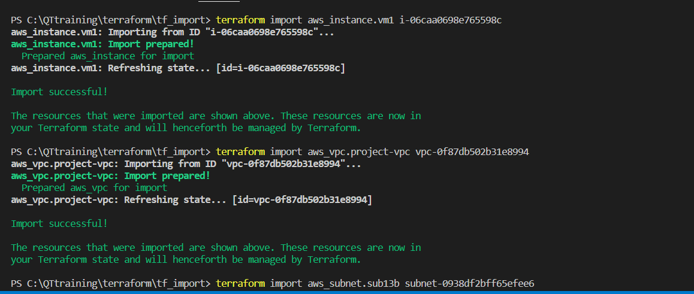
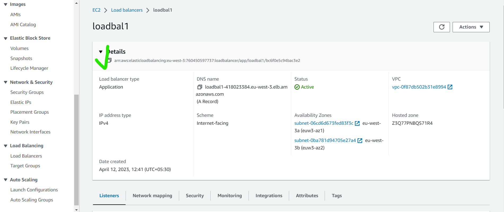
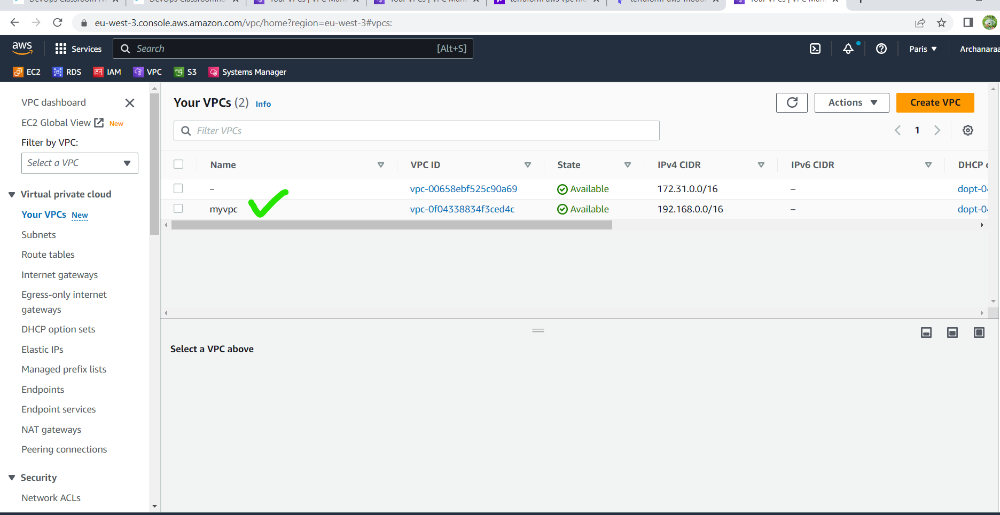
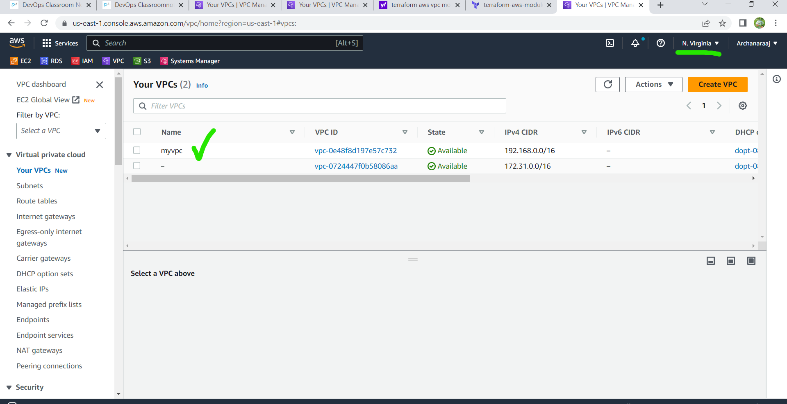

### create manually vpc's ,subnets,2 vm's load balancer and import terraform

C:\QTtraining\terraform\teamsmeeting\tf_import
* create manually first vpc(192.168.0.0/16)
* and next create 4 subnets with that vpc
* it's directly create vpc and more in that create 4subnets with(192.168.0.0/24)
* next create 2 instances with that vpc and in that selected vpc under enable public access
* after that create two vm's vm1&vm2 with selected myvpc and with 2 public subnets
* next create load balancer application load balancer and in that create target group also then created load balancer.
* After manual process completed then goto VSC create one file main.tf
* in that write resourse for import all above vpc ,subnets,vm's,load balncer for that  
  [Referhere](https://developer.hashicorp.com/terraform/cli/import/usage)
* in that main.tf file we have to mention the vms vpc names same in manual process names only
* and in load balancer resources give arn id 
* in the task =>create a load balncer to forward the request to two vms(instances)
* for this process connected 2 vm's in terminal and in one vm install apache and in another vm install ngnix
* next goto that loadbalncer copy the DNS paste in newtab ngnix page came reload and apache page is came
*  
* 
* 
  
  ### use this commands for import
```
terraform import aws_instance.vm1 i-06caa0698e765598c
terraform import aws_vpc.project-vpc vpc-0f87db502b31e8994
terraform import aws_subnet.sub13b subnet-0938df2bff65efee6
terraform import aws_subnet.sub23apublic subnet-06cd6d673fed83f3c

```




next for target group importing purpose we want arn id 


```
terraform import aws_lb.loadbal1 arn:aws:elasticloadbalancing:eu-west-3:760450597737:loadbalncer/app/loadbal1/bc6f0e5c94bac3e2
terraform import aws_tg.targetgrp1 arn:aws:elasticloadbalancing:eu-west-3:760450597737:targetgroup/targetgrp1/4ced3800cd4095ec

```

* After importing check once in our AWS account and delete all manually and terraform destory
  
### activity2
   C:\QTtraining\terraform\teamsmeeting\activity2
* for this activity first we can create vpc through terraform and in provider we can use multi provider and multi regions with alias
[Referhere](https://registry.terraform.io/modules/terraform-aws-modules/vpc/aws/latest)

```
terraform init 
terraform apply

```

After creating vpc
check in two regions



### activity3
C:\QTtraining\terraform\teamsmeeting\activity3
* 1.create a network,add subnet one,add subnet two,  rename the subnet one with web and two with app with terraform state mv,
Now add one more subnet db ,remove the state of db using terraform state mv.
  
-----------------------------

* first we can create one vpc and two subnets with name of one,two.
* next terraform init
* terraform apply
*  check once in tfstate two subnet names one,two
*  then next command 
for moving subnet.one to subnet.web
```
terraform state mv aws_subnet.one aws_subnet.web

```
* next check tfstate file that subnet names are change
* Next create another subnet db
* for removing db subnet command
```
terraform state rm aws_subnet.db 

```