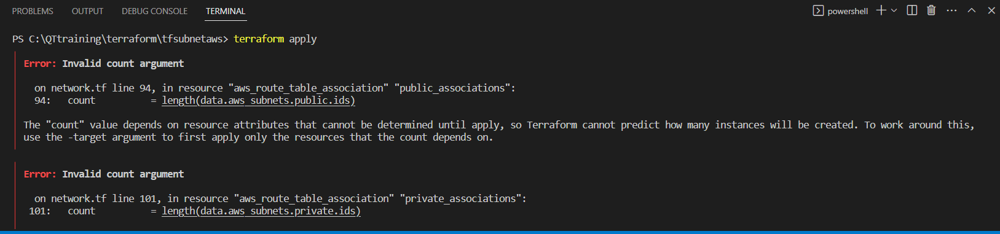

If this error came 
first we can create route table then we can create route table association so first terraform apply after that add this resources
```
resource "aws_route_table_association" "public_associations" {
  count          = length(data.aws_subnets.public.ids)
  route_table_id = aws_route_table.public.id
  subnet_id      = data.aws_subnets.public.ids[count.index]

}

resource "aws_route_table_association" "private_associations" {
  count          = length(data.aws_subnets.private.ids)
  route_table_id = aws_route_table.private.id
  subnet_id      = data.aws_subnets.private.ids[count.index]

}

```

then terraform apply 
next terraform destroy